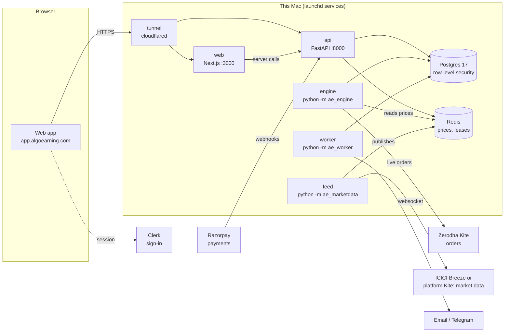

# AlgoEarning architecture

AlgoEarning is a multi-user algo-trading platform for Indian index options. Users build strategies, test them on
history and on paper, and deploy them on their own Zerodha accounts. This page explains how the pieces fit together
and where each one lives. The reasons behind each choice are in the [architecture decision records](adr/README.md).
The commands for working on the code are in [CONTRIBUTING.md](../CONTRIBUTING.md).

## The big picture



Seven processes share one Postgres database and one Redis:

| Process  | What it does                                                                                            | Code                     |
| -------- | ------------------------------------------------------------------------------------------------------- | ------------------------ |
| `web`    | Next.js 16 app: landing page, dashboard, strategy builder, runs, reports, the Monitor admin panel       | `apps/web`               |
| `api`    | FastAPI. The only door to the data for browsers: auth, strategies, runs, brokers, billing, admin        | `apps/api`               |
| `engine` | Steps every running strategy once a second, on paper or live on Zerodha                                 | `apps/engine`            |
| `feed`   | One market-data feed for the whole platform: streams Breeze (or Kite) prices into Redis, or simulates   | `packages/py-marketdata` |
| `worker` | Background jobs: sends notifications, runs backtests, refreshes instruments daily, checks the public IP | `apps/worker`            |
| Postgres | All durable data. Every user-owned table has row-level security                                         | `packages/py-db`         |
| Redis    | Live prices, the engine's single-runner lease, short-lived state such as login nonces                   | (no code of its own)     |

## Repository layout

```
apps/
  web/              Next.js web app (App Router). app/ = pages, components/ = feature UI, lib/ = API clients
  api/              FastAPI app ae_api: routers/, auth/ (Clerk + dev header), billing/ (Razorpay), settings.py
  engine/           ae_engine: the engine loop (engine.py), paper fills (paper.py), Zerodha orders (live.py)
  worker/           ae_worker: job schedule (__main__.py), notifications, backtests, public IP check
packages/
  py-core/          ae_core: the trading domain, pure Python with no I/O
                      strategy.py (config schemas), trading/ (runners, risk, option choice, SMC detectors),
                      backtest.py, reports.py, billing.py, entitlements.py, notifications.py, secrets.py
  py-db/            ae_db: SQLAlchemy models, Alembic migrations, row-level security, repositories
  py-brokers/       ae_brokers: broker adapters (Zerodha/Kite today), instrument lists
  py-marketdata/    ae_marketdata: the feed, the Redis price hub, history import and backfill
  ui/               @algoearning/ui: theme tokens (light + dark) and shared React components
  shared/           @algoearning/shared: TypeScript helpers (number formatting, P&L maths)
  api-types/        @algoearning/api-types: TypeScript types generated from the API's OpenAPI spec
  config/           shared tsconfig and ESLint settings
scripts/            dev.sh (make dev), local-db.sh, home-host.sh + home-service.sh (production on this Mac)
infra/docker/       Dockerfiles and compose for running the whole stack in containers
docs/               this page, home-hosting.md, adr/ (one file per architecture decision)
```

It is one monorepo with two toolchains. **pnpm + Turborepo** run the TypeScript workspaces, and a **uv** workspace
runs the Python packages. Each Python app depends on the `packages/py-*` libraries it needs.

## Backend

**API (`apps/api`).** FastAPI with Pydantic models. `main.py:create_app` wires the pieces together. Each area
has a router in `routers/`: `me`, `plans`, `strategies`, `runs`, `market`, `charts`, `backtests`, `reports`,
`notifications`, `billing`, `brokers`, `webhooks`, `monitor` and `admin`. All routes sit under `/v1`, and
`/health` is the liveness check. Errors share one JSON shape (`errors.py`). Every request gets a request id and
an access-log line (`middleware.py`). In development, the OpenAPI docs are at http://localhost:8000/docs.

**Auth.** Clerk handles sign-in in the browser. The browser, and the Next.js server acting for it, sends Clerk's
session token as a Bearer token. The API checks it against Clerk's public keys and the allowed origins
(`auth/clerk.py`). The first time it sees a user, it creates their `users` row. In development only, the
`X-Dev-User` header (`DEV_AUTH=true`) stands in for Clerk. The API refuses to start with it switched on in
production.

**Data isolation.** Postgres enforces it, not just the code (`ae_db/rls.py`, ADR 0005). Every user request runs
as the `ae_app` role with `app.user_id` set, so a query that forgets a `WHERE user_id = …` still only sees that
user's rows. Trusted paths use `ae_system`: the engine, the worker, webhooks and admin.

**Trading domain (`packages/py-core`).** Pure code with no database or network, so it can be tested in
isolation. A strategy is a typed config (`strategy.py`); the builder's kind is `rules` (entry time, intraday or
overnight holding, entry on conditions, legs, trade limits; ADR 0022, 0023), next to the fixed `range_breakout`, `zero_dte` and `smc_scalp`.
Its _runner_ (`trading/runners.py`, `smc_runner.py`) decides entries and exits from prices. `risk.py` applies stop-losses, targets and daily limits. The same runners
drive live trading, paper trading and backtests (ADR 0017), so all three behave the same.

**Engine (`apps/engine`).** One process steps every active run every second (ADR 0014). Paper runs fill against
feed prices (`paper.py`). Live runs place orders through Kite (`live.py`, ADR 0015), using that user's encrypted
API key and that day's session. A Redis lease makes sure only one engine trades at a time; a second copy stands
by. Each run writes a heartbeat, and the worker alerts users when the heartbeat stops.

**Market data (`packages/py-marketdata`).** One feed for the whole platform (ADRs 0006 and 0013). It streams
from ICICI Breeze by default, or from the platform's own Kite account (ADR 0021, `MARKET_DATA_SOURCE=kite`), or
simulates prices when no keys are set, and publishes to Redis through `Hub`. The
engine and the API only ever read Redis. Option contracts stream only while something asks for them. Each day's
candles are archived to Postgres for backtesting. The Charts page's live candles and SMC zones are built from the
same bars and ticks in the API (`ae_api/charts.py`) and streamed to the browser as server-sent events (ADR 0020).

**Brokers (`packages/py-brokers`).** An adapter per broker; Zerodha is the one available today (ADR 0007). API
keys are envelope-encrypted with `APP_ENCRYPTION_KEY` (`ae_core/secrets.py`) and never returned by the API. Each
morning the user logs in through Kite's redirect to `/v1/brokers/zerodha/callback`.

**Worker (`apps/worker`).** Two kinds of job:

- Daily jobs: refresh instruments at 08:00 and archive the day's history at 16:05 (IST).
- Jobs that repeat every few seconds or minutes: send queued notifications by email and Telegram, link Telegram
  chats, raise the engine-down alert, run queued backtests, and check the public IP (ADR 0019).

It also has one-off commands: `backfill`, `import-history` and `smc-report`.

**Payments.** Razorpay prepaid plans (ADR 0008). The API creates the order, and the Razorpay webhook confirms
it. Plans set each user's limits (`entitlements.py`), and admins can override them from Monitor.

**Database changes.** Models live in `packages/py-db/src/ae_db/models.py`, and Alembic migrations in
`migrations/versions`. `make migration m="…"` generates a migration and `make migrate` applies it. The API
service applies pending migrations when it starts in production.

## Frontend

**Next.js 16 (App Router) with React 19 and Tailwind CSS 4** (`apps/web`).

- **Pages:** signed-in pages live in `app/(app)/`, one folder per section (dashboard, charts, builder, strategies,
  runs, backtesting, reports, brokers, notifications, subscription, profile). Monitor, the admin panel, is in
  `app/monitor/`.
- **Data:** pages are server components that call the API with the user's token (`lib/api.ts: apiGet`). Browser
  actions call it directly (`lib/client-api.ts`). Live screens refresh every few seconds.
- **Request proxy:** `proxy.ts`, formerly middleware, runs Clerk on every request. It also sends Breeze's login
  redirect to Monitor and serves Monitor's home page on `monitor.` hosts.
- **Types:** the API's types come from its OpenAPI spec (`packages/api-types`). Run `make types` after changing
  API models. CI fails if they're stale.
- **Design:** every colour is a theme token from `packages/ui/src/styles.css`, and every screen works in light
  and dark. CI checks WCAG AA contrast for both themes (`scripts/check-contrast.py`).

## Environments

| Where                     | How it runs                                   | Configuration                                            |
| ------------------------- | --------------------------------------------- | -------------------------------------------------------- |
| Development               | `make dev`: every process with live reload    | `.env`, `apps/web/.env.local` (from the `.example`s)     |
| Production (today)        | This Mac, launchd services, Cloudflare Tunnel | adds `.env.production`, `apps/web/.env.production.local` |
| Containers (later: a VPS) | `make up` / `infra/docker`                    | environment variables                                    |

Production today is at https://app.algoearning.com (web), https://api.algoearning.com and
https://monitor.algoearning.com. They are served from the Mac as described in [home-hosting.md](home-hosting.md)
and ADR 0019. The landing page has one source, `apps/landing` (static HTML and CSS). Render serves it at
https://algoearning.com. The web app serves the same files as its home page for signed-out visitors:
`apps/web/scripts/sync-landing.mjs` copies them into `public/` before `next dev` and `next build`, and
`proxy.ts` sends signed-in visitors from `/` to `/dashboard`.

## Where to look for…

| Question                                 | Start here                                                         |
| ---------------------------------------- | ------------------------------------------------------------------ |
| How a strategy decides to enter or exit  | `packages/py-core/src/ae_core/trading/runners.py`, `smc_runner.py` |
| How an order reaches Zerodha             | `apps/engine/src/ae_engine/live.py`, `packages/py-brokers`         |
| Why a user can't see someone else's data | `packages/py-db/src/ae_db/rls.py`, ADR 0005                        |
| What a plan allows                       | `packages/py-core/src/ae_core/entitlements.py`, ADR 0012           |
| Where prices come from                   | `packages/py-marketdata/src/ae_marketdata/service.py`, ADR 0013    |
| What gets notified, and how              | `packages/py-core/src/ae_core/notifications.py`, ADR 0016          |
| A page in the web app                    | `apps/web/app/(app)/<section>/page.tsx`                            |
